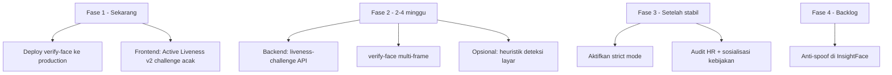

# Catatan Diskusi — Mitigasi Bypass Presensi via Video Call

**Untuk:** Tim frontend mobile/web (`sikat-navy-flow`) + backend Laravel SIKAT  
**Tanggal:** Juni 2026  
**Status:** Draft untuk diskusi — belum ada keputusan final implementasi

**Dokumen terkait:**
- [`BACKEND_INSIGHTFACE_PRESENSI.md`](BACKEND_INSIGHTFACE_PRESENSI.md) — arsitektur InsightFace
- [`API_ABSENSI.md`](../API_ABSENSI.md) — kontrak API absensi
- [`FRONTEND_INSIGHTFACE_PRESENSI.md`](FRONTEND_INSIGHTFACE_PRESENSI.md) — panduan frontend existing

---

## 1. Masalah yang dilaporkan

Presensi bisa **tembus** jika seseorang di lokasi kantor mengarahkan kamera ke **layar HP/laptop** yang menampilkan **video call** wajah pegawai yang benar (bukan foto cetak).

Contoh skenario:

```
Pegawai A (di rumah) ←── video call ──→ Rekan B (di kantor)
                                              │
                                              ▼
                                    Kamera app → layar HP
                                              │
                                              ▼
                              InsightFace: MATCH (wajah memang A)
                              GPS: OK (B ada di radius kantor)
                              Liveness kedip: OK (video hidup bisa kedip)
```

**Ini bukan bug face-match** — sistem memang mengenali wajah pegawai yang terdaftar. Yang lemah adalah **anti-spoof** (membedakan wajah asli vs wajah di layar).

---

## 2. Kenapa proteksi saat ini belum cukup

| Lapisan existing | Bisa vs foto cetak? | Bisa vs video call? |
|------------------|---------------------|---------------------|
| Kedip mata | ✅ Cukup | ❌ Video hidup bisa kedip |
| Cek 2 frame / tekstur statis | ✅ Cukup | ❌ Video hidup bergerak |
| Descriptor lokal 1:1 (face-api) | ✅ Wajah orang lain | ❌ Layar tetap wajah yang benar |
| InsightFace verify (server) | ✅ Wajah vs NIK | ❌ Layar menampilkan wajah NIK yang sama |
| GPS + radius | ✅ Lokasi | ❌ Attacker ada di lokasi |
| `strict` mode backend | ✅ Mismatch ditolak | ❌ Match tetap lolos |

**InsightFace saat ini** hanya membandingkan **embedding wajah** — tidak mendeteksi apakah wajah berasal dari manusia langsung atau dari layar.

**Kendala tim backend:** Tidak bisa mengubah service Python di `192.168.10.44:6700` (InsightFace). Mitigasi jangka pendek fokus ke **frontend + Laravel API**, bukan model baru di server InsightFace.

---

## 3. Target realistis

| Target | Keterangan |
|--------|------------|
| **Bisa dicapai (P0–P2)** | Membuat bypass **jauh lebih sulit** + jejak audit untuk SDI/HRD |
| **Tidak realistis tanpa upgrade server/SDK** | Proteksi 100% seperti Face ID hardware |

> Presensi digital tidak pernah 100% anti-curang — kombinasi **teknis + kebijakan + audit** yang dipakai industri.

---

## 4. Opsi mitigasi — untuk didiskusikan

### Opsi A — Active Liveness v2 (Frontend, prioritas tinggi)

**Ide:** Ganti "1 foto + kedip" dengan **challenge acak real-time** sebelum shutter.

**Alur usulan:**

```
1. App generate / minta urutan challenge acak
   Contoh: ["turn_left", "blink", "turn_right"]
2. User wajib menyelesaikan di kamera (5–8 detik)
3. App ambil 3–5 frame (bukan 1 JPEG)
4. Validasi client-side (landmark/pose) antar frame
5. POST /verify-face → POST /submit
```

**Mengapa membantu vs video call:**

- Urutan **acak** — video pre-recorded tidak bisa menjawab
- Attacker harus **koordinasi real-time** dengan pegawai di ujung call (delay WhatsApp/Zoom)
- Gerak kepala cepat sering **blur/gagal** di layar HP

**Effort:** Sedang (frontend `face-utils.ts`, `Presensi.tsx`)  
**Owner:** Frontend  
**Butuh backend?** Opsional (Opsi B) untuk challenge dari server

**Poin diskusi frontend:**

- [ ] Library landmark: face-api.js / MediaPipe — mana yang sudah dipakai?
- [ ] Challenge apa saja yang feasible di web + Capacitor?
- [ ] UX: berapa detik maks sebelum user frustrasi?
- [ ] Fallback jika kamera lemah / pencahayaan buruk?

---

### Opsi B — Challenge-Response dari Server (Backend + Frontend)

**Ide:** Backend mengeluarkan token challenge; frontend submit frame + `challenge_id`.

**Endpoint usulan (belum ada):**

| Method | Endpoint | Fungsi |
|--------|----------|--------|
| `GET` | `/api/absensi/liveness-challenge` | Return `{ challenge_id, steps[], expires_at }` |
| `POST` | `/api/absensi/verify-face` | Terima `challenge_id` + `frames[]` (3–5 foto) |

**Validasi backend (tanpa ML anti-spoof):**

- Challenge belum expired (±60 detik)
- Jumlah frame sesuai
- Timestamp antar frame wajar (bukan upload sekaligus curiga)
- Verify InsightFace pada frame terakhir / terbaik
- Log audit: `challenge_id`, jumlah frame, skor

**Effort:** Sedang (backend) + sedang (frontend kirim multi-frame)  
**Owner:** Backend + Frontend  

**Poin diskusi:**

- [ ] Format payload: `frames[]` base64 vs multipart?
- [ ] Berapa frame minimum/maksimum?
- [ ] Apakah `verify-face` existing perlu breaking change?

**Catatan:** Endpoint `POST /api/absensi/verify-face` **sudah ada di kode** backend tapi perlu **deploy production** (saat ini 404 di live).

---

### Opsi C — Heuristik Deteksi Layar (Frontend)

**Ide:** Sebelum submit, cek apakah wajah kemungkinan berasal dari **layar**, bukan wajah langsung.

**Sinyal yang bisa dicek client-side:**

| Sinyal | Indikasi layar |
|--------|----------------|
| Moiré / pola garis refresh | Foto layar AMOLED/LCD |
| Border persegi (bezel) di sekitar wajah | HP/laptop frame |
| Pencahayaan wajah terlalu uniform | Flat display |
| Tidak ada micro-movement alami | Static hold |

**Effort:** Sedang–tinggi (akurasi terbatas, false positive)  
**Owner:** Frontend  

**Poin diskusi:**

- [ ] Apakah mau hard-reject atau soft-warning + audit?
- [ ] Risiko false positive (kacamata, masker, pencahayaan buruk)?

---

### Opsi D — Color Flash Challenge (Frontend, advanced)

**Ide:** App tampilkan **warna acak** fullscreen sebentar; wajah asli memantulkan warna berbeda vs layar.

**Contoh:** Flash merah → cek perubahan di area pipi/dahi via kamera.

**Effort:** Tinggi  
**Owner:** Frontend  
**Efektivitas vs video call:** Sedang–tinggi (layar tidak reflect dengan benar)

**Poin diskusi:**

- [ ] Feasible di PWA/webview Capacitor?
- [ ] Aksesibilitas (photosensitive users)?

---

### Opsi E — Strict Mode + Audit (Backend + Kebijakan)

**Ide:** Aktifkan `FACE_VERIFY_MODE=strict` agar server menolak presensi sebelum tulis DB jika wajah tidak cocok.

```env
FACE_VERIFY_MODE=strict
INSIGHTFACE_MIN_SCORE=70
```

| Situasi | Dampak |
|---------|--------|
| Wajah orang lain | ❌ Ditolak server |
| Video call wajah sendiri | ⚠️ **Tetap lolos** (match) |
| Belum enroll | ❌ Ditolak |

**Effort:** Kecil (ubah `.env` + deploy)  
**Owner:** Backend / ops  

**Syarat aman:** Deploy `verify-face` dulu + mayoritas pegawai sudah enroll.

**Poin diskusi:**

- [ ] Kapan timeline aktifkan strict?
- [ ] Pesan error untuk pegawai belum enroll?

---

### Opsi F — Pertahankan Foto Presensi + Review HR (Operasional)

**Ide:** Simpan JPEG presensi di `public/presensi/` untuk audit manual SDI.

**Keterbatasan vs video call:** Foto layar mungkin terlihat blur/artifacts — HR bisa curiga, tapi tidak otomatis.

**Effort:** Sudah jalan  
**Owner:** HR/SDI + backend (existing)

**Poin diskusi:**

- [ ] Apakah HR punya bandwidth review foto?
- [ ] Nanti mau migrasi ke model tanpa simpan foto (Face ID-like)?

---

### Opsi G — Anti-Spoof di Server InsightFace (Fase jangka panjang)

**Ide:** Tambah model passive liveness (MiniFASNet, Silent-Face-Anti-Spoofing) di pipeline Python InsightFace.

**Kendala:** Tim saat ini **tidak punya akses** ubah server `192.168.10.44`.

**Effort:** Besar (tim infra / vendor InsightFace)  
**Efektivitas:** Tinggi  

**Action:** Koordinasi ke tim yang maintain InsightFace — item backlog, bukan sprint ini.

---

### Opsi H — SDK Liveness Komersial (Fase jangka panjang)

Contoh: FaceTec, AWS Rekognition Face Liveness, Azure Face Liveness, iProov.

**Effort:** Besar + biaya lisensi  
**Efektivitas:** Sangat tinggi  

**Poin diskusi:** Budget & compliance data (foto/wajah ke cloud vendor).

---

## 5. Matriks perbandingan cepat

| Opsi | Owner | Effort | Vs video call | Vs foto cetak | Butuh InsightFace? |
|------|-------|--------|---------------|---------------|------------------|
| A — Active liveness v2 | Frontend | Sedang | Tinggi | Tinggi | Tidak |
| B — Challenge-response API | BE + FE | Sedang | Sedang | Sedang | Tidak |
| C — Deteksi layar | Frontend | Sedang | Sedang | Rendah | Tidak |
| D — Color flash | Frontend | Tinggi | Tinggi | Tinggi | Tidak |
| E — Strict mode | Backend | Kecil | Rendah* | Sedang | Tidak |
| F — Audit foto HR | Ops | Kecil | Rendah | Sedang | Tidak |
| G — Anti-spoof InsightFace | Infra | Besar | Tinggi | Tinggi | Ya |
| H — SDK komersial | BE + FE | Besar | Sangat tinggi | Sangat tinggi | Opsional |

\*Strict tidak menghentikan video call wajah **sendiri** — hanya mismatch/orang lain.

---

## 6. Usulan prioritas (draft — untuk disepakati bersama)



| Prioritas | Item | Owner |
|-----------|------|-------|
| **P0** | Deploy `POST /api/absensi/verify-face` (404 → 200) | Backend |
| **P0** | Active liveness v2: turn + blink acak, multi-frame | Frontend |
| **P1** | `GET /liveness-challenge` + verify-face terima `frames[]` | Backend + Frontend |
| **P1** | Integrasi alur: challenge → verify-face → submit | Frontend |
| **P2** | Heuristik deteksi layar (soft warning) | Frontend |
| **P2** | Aktifkan `strict` + enroll massal | Backend + Ops |
| **P3** | Color flash / SDK / InsightFace anti-spoof | TBD |

---

## 7. Alur presensi usulan (setelah P0+P1)

```
┌─────────────────────────────────────────────────────────────┐
│ 1. Buka Presensi → cek jadwal/GPS (existing)                │
│ 2. GET /liveness-challenge (opsional P1)                    │
│ 3. Kamera preview → challenge acak (turn/blink)             │
│ 4. Ambil 3-5 frame in-memory                                │
│ 5. POST /verify-face → kartu hijau/merah                    │
│ 6. Jika verified → POST /submit                             │
│ 7. Jika mismatch + soft → dialog audit SDI (existing)       │
└─────────────────────────────────────────────────────────────┘
```

---

## 8. Pertanyaan untuk meeting frontend

1. **Library wajah:** face-api.js / MediaPipe / lain — apa yang dipakai sekarang di `face-utils.ts`?
2. **Platform:** Hanya Capacitor mobile, atau web presensi juga?
3. **UX challenge:** Turn kiri/kanan + kedip — apakah acceptable untuk pegawai non-teknis?
4. **Multi-frame:** Kirim 3–5 JPEG ke server — concern ukuran payload / performa?
5. **Video call test:** Bisa uji internal dengan skenario "layar WhatsApp" sebelum production?
6. **Strict mode:** Kapan siap wajibkan enroll + tolak mismatch di server?
7. **False positive:** Jika deteksi layar salah blokir pegawai honest — prefer hard block atau warning?

---

## 9. Yang sudah siap di backend (Juni 2026)

| Item | Status kode | Status production |
|------|-------------|-------------------|
| `POST /enroll-face` | ✅ | ✅ |
| `GET /face-status` (+ nik, nama) | ✅ | ✅ |
| `POST /verify-face` | ✅ | ❌ Perlu deploy |
| `POST /submit` + face_verification | ✅ | ✅ |
| `strict` mode gate | ✅ | ❌ `.env` masih `soft` |
| Anti-spoof ML server-side | ❌ | ❌ Butuh akses InsightFace |

---

## 10. Keputusan yang perlu dicatat setelah diskusi

| # | Keputusan | Disetujui? | Tanggal | PIC |
|---|-----------|------------|---------|-----|
| 1 | Opsi A (active liveness v2) — scope challenge | ☐ | | |
| 2 | Opsi B (liveness-challenge API) — ya/tidak | ☐ | | |
| 3 | Jumlah frame minimum untuk verify-face | ☐ | | |
| 4 | Timeline deploy verify-face production | ☐ | | |
| 5 | Timeline aktifkan strict mode | ☐ | | |
| 6 | Opsi C/D masuk roadmap atau tidak | ☐ | | |
| 7 | Eskalasi ke tim InsightFace (Opsi G) | ☐ | | |

---

## 11. Referensi singkat env backend

```env
INSIGHTFACE_ENABLED=true
INSIGHTFACE_BASE_URL=http://192.168.10.44:6700
INSIGHTFACE_MIN_SCORE=70          # skala 0-100, jangan 0.40
FACE_VERIFY_MODE=soft             # strict setelah rollout
```

---

*Draft catatan diskusi — revisi setelah meeting frontend. Bukan spesifikasi final implementasi.*
