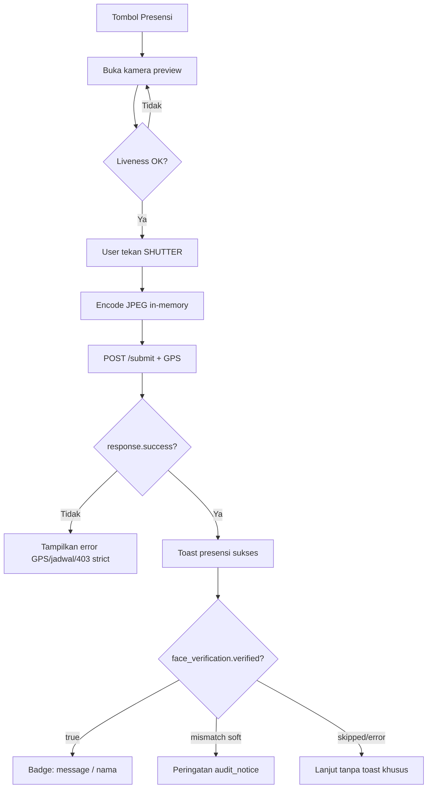

# Spesifikasi Frontend — Integrasi InsightFace (Presensi)

Dokumen ini untuk **tim mobile / frontend** (`sikat-navy-flow` atau client Capacitor/React Native).  
Kontrak API lengkap: [`API_ABSENSI.md`](../API_ABSENSI.md).  
Spesifikasi backend internal: [`BACKEND_INSIGHTFACE_PRESENSI.md`](BACKEND_INSIGHTFACE_PRESENSI.md).

**Prinsip utama (fase 1 — production-safe):**

> Presensi existing **tidak boleh rusak**. Verifikasi wajah adalah **tambahan informatif**, bukan gate wajib di mobile.  
> Pegawai yang **belum** enroll wajah tetap bisa absen seperti sekarang.  
> Mobile **tidak** memanggil server InsightFace (`192.168.10.44:6700`) langsung — semua lewat Laravel API.

**Ruang lingkup fase 1:**

| Termasuk | Tidak termasuk |
|----------|----------------|
| Capture kamera in-memory (shutter → kirim API) | Panggil InsightFace LAN langsung |
| Enroll opsional di Profil | Blokir presensi jika belum enroll |
| Baca `face_verification` setelah submit | Endpoint verify terpisah |
| Liveness / anti-spoof di client | Deteksi foto cetak di backend |
| Toast/badge informatif (soft mode) | Mode `strict` wajib di UI (fase 2) |

---

## 1. Arsitektur (sudut pandang mobile)

```
┌─────────────────────────────────────────────────────────────────┐
│  Mobile App (Capacitor / React Native)                          │
│  ┌──────────────┐  ┌──────────────┐  ┌────────────────────────┐ │
│  │ Kamera       │  │ Liveness     │  │ API Client             │ │
│  │ (in-memory)  │→ │ (face-utils) │→ │ Laravel Sanctum Bearer │ │
│  └──────────────┘  └──────────────┘  └───────────┬────────────┘ │
└──────────────────────────────────────────────────│──────────────┘
                                                   │ HTTPS
                                                   ▼
                              https://sikat.rsaisyiyahsitifatimah.com/api
                              ├── GET  /absensi/face-status
                              ├── POST /absensi/enroll-face
                              └── POST /absensi/submit  (+ face_verification)
                                                   │
                                                   ▼ (server-side only)
                              InsightFace 192.168.10.44:6700
                              POST /face-verification?name={NIK}
```

| Komponen | URL / alamat |
|----------|--------------|
| API SIKAT (mobile pakai ini) | `https://sikat.rsaisyiyahsitifatimah.com/api` |
| InsightFace (LAN) | **Jangan dipanggil dari mobile** |

---

## 2. Analogi dengan script Python uji (`refpytonbyverif.md`)

Tim backend menguji alur verifikasi 1:1 dengan script OpenCV + `requests`. Mobile harus meniru **konsep** yang sama, bukan endpoint LAN-nya.

| Langkah script Python | Setara di mobile |
|----------------------|------------------|
| Input NIK karyawan | **Tidak perlu** — backend ambil NIK dari token login |
| `cv2.VideoCapture(0)` | `@capacitor/camera` / `react-native-vision-camera` / WebRTC |
| Loop frame kamera | Preview live di UI (opsional) |
| `cv2.imencode(".jpg", frame)` | Canvas / `toBlob()` / base64 **di memori** — **tanpa simpan ke galeri** |
| `POST /face-verification?name={nik}` + multipart `file` | `POST /api/absensi/submit` atau `POST /api/absensi/enroll-face` |
| Baca `result.similarity` + `result.status` | Baca `face_verification.score` + `face_verification.verified` |
| Overlay "ACCESS GRANTED" | Toast / badge hijau + `face_verification.message` |
| Threshold similarity ≥ 80% (script) | Server pakai `INSIGHTFACE_MIN_SCORE` (default **70**) — **jangan hardcode threshold di mobile untuk keputusan final** |

**Perbedaan penting:**

| Script Python (uji) | Mobile production |
|----------------------|-------------------|
| Langsung ke `192.168.10.44:6700` | Hanya ke Laravel `/api/...` |
| Loop otomatis tiap 2 detik | **Shutter sekali** → satu request submit |
| Hanya verify, tidak simpan presensi | Submit = presensi + verify sekaligus |
| `/face-search` (identifikasi siapa saja) | **Tidak dipakai** — backend pakai `/face-verification` 1:1 vs NIK login |

Referensi script: [`refpytonbyverif.md`](refpytonbyverif.md) (verify 1:1), [`refpython.md`](refpython.md) (search 1:N — **hanya referensi lab**, bukan alur app).

---

## 3. Capture kamera — tanpa simpan ke galeri

**Rekomendasi utama:** ambil frame dari preview kamera → encode JPEG di memori → kirim ke API. Tidak perlu menyimpan file ke storage HP sebelum upload.

### Alur shutter (presensi)

```
1. Buka kamera depan (preview)
2. [Opsional] Liveness check (kedip / 2 frame)
3. User tekan tombol SHUTTER
4. Ambil frame → Blob JPEG (quality ~0.85, max lebar 1280px)
5. FormData: image + latitude + longitude + is_mock_location
6. POST /api/absensi/submit
7. Tampilkan hasil presensi (success) + info face_verification
```

### Yang disimpan di mana

| Lokasi | Disimpan? | Keterangan |
|--------|-----------|------------|
| Galeri / file HP | ❌ Tidak perlu | Capture langsung ke Blob/base64 |
| Server `public/presensi/` | ✅ Otomatis | Backend simpan arsip foto presensi |
| Embedding wajah | ❌ Tidak di mobile | Hanya di server InsightFace |

### Format kirim (pilih satu, konsisten)

**Multipart (disarankan React Native / Capacitor):**

```typescript
const form = new FormData();
form.append('image', {
  uri: blobUri,          // atau file dari capture
  name: 'selfie.jpg',
  type: 'image/jpeg',
} as any);
form.append('latitude', String(lat));
form.append('longitude', String(lng));
form.append('is_mock_location', 'false');

await fetch(`${API_BASE}/absensi/submit`, {
  method: 'POST',
  headers: { Authorization: `Bearer ${token}` },
  body: form,
});
```

**JSON base64:**

```typescript
const base64 = await blobToDataUrl(jpegBlob); // "data:image/jpeg;base64,..."

await fetch(`${API_BASE}/absensi/submit`, {
  method: 'POST',
  headers: {
    Authorization: `Bearer ${token}`,
    'Content-Type': 'application/json',
  },
  body: JSON.stringify({
    image: base64,
    latitude: lat,
    longitude: lng,
    is_mock_location: false,
  }),
});
```

| Aturan | Nilai |
|--------|-------|
| Format | JPEG, JPG, PNG |
| Ukuran max | 2 MB |
| Resolusi disarankan | 640–1280 px lebar (cukup untuk verify, hemat bandwidth) |

---

## 4. Mode operasi server (pengaruh ke UI)

Mobile **tidak** mengatur mode — baca dari `GET /api/absensi/face-status` → field `verify_mode`.

| `verify_mode` | Perilaku mobile |
|---------------|-----------------|
| `soft` (default) | Presensi **selalu sukses** jika GPS/jadwal OK; `face_verification` informatif saja |
| `strict` (fase 2) | Submit bisa **HTTP 403** jika belum enroll / mismatch / error InsightFace |

### Matriks UI — mode `soft`

| `face_verification.status` | `verified` | Presensi sukses? | UI disarankan |
|----------------------------|------------|------------------|---------------|
| `match` | `true` | ✅ | Badge hijau / toast: `message` |
| `mismatch` | `false` | ✅ | Peringatan kuning + `audit_notice` (lihat §8) |
| `skipped` | `false` | ✅ | Tidak perlu toast; banner enroll di Profil |
| `error` | `false` | ✅ | Abaikan atau toast abu-abu ringan |

### Matriks UI — mode `strict`

| Situasi | HTTP | UI disarankan |
|---------|------|---------------|
| Belum enroll | 403 | Dialog: arahkan ke Profil → Daftarkan Wajah |
| Mismatch | 403 | Dialog error + tombol ambil ulang foto |
| Match | 200 | Sukses presensi + badge verify |
| InsightFace error | 403 | Dialog: coba lagi / hubungi admin |

**Jangan** gunakan `face_verification` sebagai satu-satunya penentu sukses presensi di mode `soft` — selalu cek `success` di root response.

---

## 5. Endpoint yang dipakai mobile

Semua memerlukan:

```http
Authorization: Bearer {token}
```

| Prioritas | Method | Endpoint | Kapan |
|-----------|--------|----------|-------|
| P0 | `POST` | `/api/absensi/submit` | Presensi datang/pulang — verify otomatis |
| P1 | `GET` | `/api/absensi/face-status` | Buka Profil; optional sebelum presensi |
| P1 | `POST` | `/api/absensi/enroll-face` | Daftar / perbarui wajah referensi |

**Tidak ada** endpoint `POST /verify-face` terpisah — verify terjadi di dalam `submit`.

---

## 6. Screen Profil — enroll wajah

### Saat mount / focus

1. `GET /api/absensi/face-status`
2. Render berdasarkan response:

```json
{
  "success": true,
  "data": {
    "nik": "278.21.11.2018",
    "nama": "Ahmad Subagiyo",
    "face_enrolled": true,
    "enrolled_at": "2026-06-07T10:00:00+07:00",
    "verify_mode": "soft"
  }
}
```

| `face_enrolled` | UI |
|-----------------|-----|
| `false` | Banner + CTA **"Daftarkan Wajah"** |
| `true` | "Terdaftar sejak {enrolled_at}" + **"Perbarui Foto Wajah"** |

### Saat enroll

1. Buka kamera depan (sama seperti presensi)
2. Shutter → capture in-memory
3. `POST /api/absensi/enroll-face` dengan field `image` saja (tanpa GPS)
4. Sukses → refresh `face-status`, toast `message`
5. Gagal (422) → tampilkan `message` ("Pastikan wajah terlihat jelas")

**Re-enroll:** panggil `POST /enroll-face` lagi — tidak perlu endpoint hapus.

---

## 7. Screen Presensi — shutter + verify

### Alur UX disarankan



### Overlay saat verify sukses (opsional, seperti script Python)

Jika `face_verification.verified === true`:

- Overlay hijau semi-transparan
- Teks: `face_verification.message` → `"Wajah terverifikasi: {nama}"`
- Skor: `face_verification.score` (0–100)
- Auto-dismiss 2–3 detik, lalu kembali ke home

---

## 8. Field `face_verification` — handling client

Response submit sukses (soft mode):

```json
{
  "success": true,
  "message": "Presensi datang berhasil dicatat.",
  "data": { "tipe": "datang", "jam_datang": "...", "status": "..." },
  "face_verification": {
    "nik": "278.21.11.2018",
    "nama": "Ahmad Subagiyo",
    "status": "match",
    "score": 99,
    "verified": true,
    "message": "Wajah terverifikasi: Ahmad Subagiyo"
  }
}
```

Response mismatch (soft mode — presensi tetap sukses):

```json
{
  "face_verification": {
    "status": "mismatch",
    "verified": false,
    "score": 42,
    "message": "Wajah tidak cocok dengan Ahmad Subagiyo",
    "audit_notice": "Wajah tidak cocok dengan data profil Anda. Apakah Anda yakin...",
    "show_confirm_dialog": true
  }
}
```

### Contoh handler TypeScript

```typescript
type FaceVerification = {
  nik: string;
  nama: string;
  status: 'match' | 'mismatch' | 'skipped' | 'error';
  score: number | null;
  verified: boolean;
  message: string | null;
  audit_notice?: string;
  show_confirm_dialog?: boolean;
};

async function handleSubmitResponse(res: {
  success: boolean;
  message: string;
  face_verification?: FaceVerification;
}) {
  if (!res.success) {
    // strict: face_rejected mungkin ada di body 403
    showError(res.message);
    return;
  }

  showSuccess(res.message);

  const fv = res.face_verification;
  if (!fv) return;

  if (fv.verified) {
    showVerifiedBadge(fv.message ?? `✓ ${fv.nama}`);
  } else if (fv.status === 'mismatch' && fv.show_confirm_dialog) {
    // Soft: presensi sudah tersimpan — peringatan informatif / audit
    showAuditNotice(fv.audit_notice ?? fv.message);
  }
}
```

### Peringatan audit SDI (soft mismatch)

Backend mengirim `audit_notice` + `show_confirm_dialog: true` saat mismatch di mode soft.

**Rekomendasi dua lapisan:**

1. **Sebelum submit** (client-side liveness / descriptor lokal): jika tidak cocok, dialog konfirmasi *"Apakah yakin lanjut? Dapat diaudit SDI"*
2. **Setelah submit** (server mismatch): tampilkan `audit_notice` meski presensi sudah sukses

---

## 9. Liveness / anti-spoof (wajib di mobile)

InsightFace **hanya** membandingkan embedding — **tidak** mendeteksi foto cetak vs wajah hidup.

| Lapisan | Tanggung jawab |
|---------|----------------|
| Mobile — liveness (kedip, gerak kepala, 2 frame) | **Wajib** sebelum shutter |
| Mobile — descriptor 1:1 lokal (opsional) | Pre-check sebelum submit |
| Backend — `strict` mode | Tolak mismatch di server |
| Backend — InsightFace | Verify 1:1 vs NIK login |

Implementasi disarankan di modul `face-utils.ts` (atau setara):

- Deteksi wajah di preview (bounding box)
- Validasi wajah cukup besar di frame
- Minimal 1 kedip atau perbedaan tekstur antar 2 frame
- Baru enable tombol shutter

---

## 10. Yang **tidak** perlu dilakukan mobile

- ❌ Memanggil `http://192.168.10.44:6700` dari app
- ❌ Mengirim NIK manual di query/body — backend pakai token
- ❌ Memblokir tombol presensi jika `face_enrolled === false`
- ❌ Membatalkan sukses presensi jika `status === 'mismatch'` (soft mode)
- ❌ Loop verify otomatis tiap 2 detik ke server (boros rate limit + baterai)
- ❌ Hardcode threshold match (mis. 80%) untuk override keputusan server
- ❌ Endpoint terpisah untuk verify — sudah ada di `submit`

---

## 11. Prioritas implementasi mobile

| Prioritas | Task |
|-----------|------|
| P0 | Capture shutter in-memory → `POST /submit` (tanpa ubah alur GPS/jadwal) |
| P0 | Baca & tampilkan `face_verification` setelah submit sukses |
| P1 | Screen Profil: `face-status` + `enroll-face` |
| P1 | Liveness basic sebelum shutter |
| P2 | Overlay "verified" + skor (UX seperti script Python) |
| P2 | Dialog audit saat mismatch soft |
| P3 | Adaptasi UI untuk `verify_mode: strict` |

---

## 12. Checklist QA mobile

| # | Skenario | Expected |
|---|----------|----------|
| 1 | Shutter → submit tanpa simpan ke galeri | HTTP 200, foto tidak ada di galeri HP |
| 2 | `GET face-status` belum enroll | `face_enrolled: false`, tombol presensi tetap aktif |
| 3 | `POST enroll-face` foto valid | HTTP 200, `face_enrolled: true` |
| 4 | Submit datang (foto sama dengan enroll) | `verified: true`, `status: match`, `score` tinggi |
| 5 | Submit pulang | Sama, ada `face_verification` |
| 6 | Belum enroll → submit | `status: skipped` |
| 7 | Foto orang lain (soft mode) | `success: true`, `status: mismatch`, ada `audit_notice` |
| 8 | Enroll tanpa foto | HTTP 422 |
| 9 | Token invalid | HTTP 401 |
| 10 | `verify_mode: strict` + belum enroll | HTTP 403, presensi tidak tersimpan |

---

## 13. Debugging

**Face status:**

```bash
curl -s -H "Authorization: Bearer {token}" \
  "https://sikat.rsaisyiyahsitifatimah.com/api/absensi/face-status"
```

**Enroll:**

```bash
curl -s -X POST -H "Authorization: Bearer {token}" \
  -F "image=@selfie.jpg" \
  "https://sikat.rsaisyiyahsitifatimah.com/api/absensi/enroll-face"
```

**Submit (verify otomatis):**

```bash
curl -s -X POST -H "Authorization: Bearer {token}" \
  -F "image=@selfie.jpg" \
  -F "latitude=-7.4856" \
  -F "longitude=112.6527" \
  -F "is_mock_location=false" \
  "https://sikat.rsaisyiyahsitifatimah.com/api/absensi/submit"
```

---

## 14. Dokumen terkait

| Dokumen | Isi |
|---------|-----|
| [`API_ABSENSI.md`](../API_ABSENSI.md) | Kontrak API lengkap + contoh response |
| [`BACKEND_INSIGHTFACE_PRESENSI.md`](BACKEND_INSIGHTFACE_PRESENSI.md) | Implementasi server, env, database |
| [`refpytonbyverif.md`](refpytonbyverif.md) | Referensi lab: verify 1:1 (OpenCV) |
| [`refpython.md`](refpython.md) | Referensi lab: search 1:N (**bukan** alur app) |
